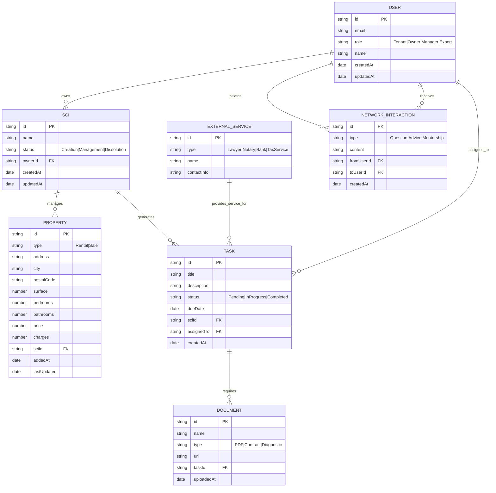

# Full Stack Diagram for Solia Invest

This document provides a comprehensive full-stack architecture diagram for the Solia Invest platform, based on the synthesis of entities and relations. The diagram is designed to be ready for coding, using Mermaid syntax for visualization.

## Entities and Relations (Data Model)

The following ER diagram shows the main entities and their relationships:



## High-Level Architecture Diagram

The following diagram shows the full-stack architecture, including frontend, backend, database, and external integrations:

```mermaid
graph TB
    subgraph "Frontend (React/Next.js)"
        A[User Interface]
        B[Dashboard]
        C[Property Management UI]
        D[Task Workflow UI]
    end

    subgraph "Backend (Node.js/Express or Python/FastAPI)"
        E[API Gateway]
        F[Authentication Service]
        G[SCI Management Service]
        H[Property Service]
        I[Task Service]
        J[Document Upload Service]
        K[External Integration Service]
    end

    subgraph "Database (PostgreSQL/MongoDB)"
        L[(User Data)]
        M[(SCI Data)]
        N[(Property Data)]
        O[(Task Data)]
        P[(Document Metadata)]
    end

    subgraph "External Services"
        Q[Lawyers/Notaries API]
        R[Banks API]
        S[Tax Services API]
        T[Payment Gateway (Stripe)]
        U[Blockchain for Security]
        V[IoT for Maintenance]
    end

    subgraph "AI/ML Services"
        W[Price Prediction]
        X[Maintenance Prediction]
        Y[Matching Algorithm]
    end

    A --> E
    B --> E
    C --> E
    D --> E

    E --> F
    E --> G
    E --> H
    E --> I
    E --> J
    E --> K

    F --> L
    G --> M
    H --> N
    I --> O
    J --> P

    K --> Q
    K --> R
    K --> S
    K --> T
    K --> U
    K --> V

    G --> W
    H --> X
    A --> Y
```

## Key Relations Summary

- **Users** are linked to **SCI** (ownership), **Tasks** (assignment), and **Network Interactions**.
- **SCI** manages **Properties** and generates **Tasks**.
- **Tasks** require **Documents** and can involve **External Services**.
- **Properties** have detailed attributes for rental/sale management.
- **External Services** provide support for legal, financial, and tax obligations.
- **Network & Mentorship** facilitates interactions between users.

This diagram serves as a blueprint for implementing the backend models, API endpoints, and frontend components. Each entity can be mapped to database schemas, and relations to foreign keys or references.
